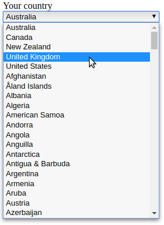

.. include:: ../Includes.txt

.. _for-developers:

================
Developer Corner
================

Target group: **Developers**, **Integrators**

.. _modification-country-list:

Modification of the Country List
================================

It is possible to change the list of options in the country selection box. This
may be the case if you want to reduce the number of countries, change the order
of the countries or perhaps add some "unofficial" countries.

For TYPO3 v9/v10 you can use a signal/slot, for TYPO3 v10 there is also a
PSR-14 event.

Both versions receive the
:php:`Brotkrueml\FormCountrySelect\Event\CountriesModificationEvent` with the
following methods:

:aspect:`->getFormIdentifier(): string`

   Get the form identifier (e.g. ``contact-42``, where ``contact`` is the
   identifier and ``42`` the content element id.

:aspect:`->getCountries(): array`

   Returns the list of countries in the format:

   ::

      [
         'DE' => 'Germany',
         'US' => 'United States',
         // ...
      ]

:aspect:`->setCountries(array $countries): void`

   Sets the countries in the same format as above.

.. attention::
   In TYPO3 v10 you can use signal/slots and PSR-14 events. If you use both,
   the PSR-14 events are called first, and the signal/slots operate on the
   modified event from the PSR-14 events.

.. _modification-country-list-psr-14:

PSR-14 Event (for TYPO3 v10)
----------------------------

With the PSR-14 event
:php:`Brotkrueml\FormCountrySelect\Event\CountriesModificationEvent` you can
change the list shown in the country selection box.

.. note::
   This is the preferred way for TYPO3 v10.

Example
~~~~~~~

So, let's start with an example. Imagine that you want to display the most
common English-speaking countries at the top of the option list.

.. rst-class:: bignums-xxl

#. Create the Event Listener

   ::

      <?php
      declare(strict_types=1);

      namespace YourVender\YourExtension\EventListener;

      use Brotkrueml\FormCountrySelect\Event\CountriesModificationEvent;

      final class ModifyCountryOrder
      {
         private $mostCommonEnglishSpeakingCountries = ['AU', 'CA', 'NZ', 'GB', 'US'];

         public function __invoke(CountriesModificationEvent $event): void
         {
            $countries = $event->getCountries();

            $topCountries = [];
            foreach ($this->mostCommonEnglishSpeakingCountries as $country) {
               $topCountries[$country] = $countries[$country];
               unset($countries[$country]);
            }

            $event->setCountries(array_merge($topCountries, $countries));
         }
      }

   The method :php:`__invoke()` implements the logic for changing the order of
   the countries. It receives the :php:`CountriesModificationEvent` where you
   can get the countries. After your changes you have to assign the new country
   list with a call to the event method :php:`setCountries()`.

#. Register your event listener in :file:`Configuration/Services.yaml`

   .. code-block:: yaml

      services:
         YourVendor\YourExtension\EventListener\ModifyCountryOrder:
            tags:
               - name: event.listener
                 identifier: 'ext-yourextension/modifyCountryOrder'
                 event: Brotkrueml\FormCountrySelect\Event\CountriesModificationEvent

.. seealso::

   You can find more information in the blog article
   `PSR-14 Events in TYPO3 <https://usetypo3.com/psr-14-events.html>`_
   and the official
   `TYPO3 documentation <https://docs.typo3.org/m/typo3/reference-coreapi/master/en-us/ApiOverview/Hooks/EventDispatcher/Index.html>`_.

.. _modification-country-list-signal-slot:

Signal/Slot (for TYPO3 v9/v10)
------------------------------

The signal :php:`modifyCountries` of the
:php:`Brotkrueml\FormCountrySelect\Domain\Model\FormElements\CountrySelect`
class enables you to modify the options in the country selection box.

.. note::
   If you use TYPO3 v10 you should use the PSR-14 event above. The signal/slot
   will be deleted when the compatibility of this extension for TYPO3 v9 is
   removed in later versions.

Example
~~~~~~~

We use the same example as for the PSR-14 event: show the most
common English-speaking countries at the top of the option list.

.. rst-class:: bignums-xxl

#. Create the Slot

   ::

      <?php
      declare(strict_types=1);

      namespace YourVendor\YourExtension\Slot;

      use Brotkrueml\FormCountrySelect\Event\CountriesModificationEvent;

      class CountriesModificationSlot
      {
         public function changeOrderOfCountries(CountriesModificationEvent $event): void
         {
            $mostCommonEnglishSpeakingCountries = ['AU', 'CA', 'NZ', 'GB', 'US'];

            $countries = $event->getCountries();
            $topCountries = [];
            foreach ($mostCommonEnglishSpeakingCountries as $country) {
                $topCountries[$country] = $countries[$country];
                unset($countries[$country]);
            }

            $event->setCountries(array_merge($topCountries, $countries));
         }
      }

   In this example, the method :php:`changeOrderOfCountries()` implements the
   logic for changing the order of the countries. It receives the
   :php:`CountriesModificationEvent` where you can get the countries. After your
   changes you have to assign the new country list with a call to the event
   method :php:`setCountries()`.

#. Register the Slot in :file:`ext_localconf.php`

   ::

      $signalSlotDispatcher = \TYPO3\CMS\Core\Utility\GeneralUtility::makeInstance(
         TYPO3\CMS\Extbase\SignalSlot\Dispatcher::class
      );
      $signalSlotDispatcher->connect(
         \Brotkrueml\FormCountrySelect\Domain\Model\FormElements\CountrySelect::class,
         'modifyCountries',
         \YourVendor\YourExtension\Slot\CountriesModificationSlot::class,
         'changeOrderOfCountries'
      );

   The third argument of the :php:`connect()` method is your slot class and the
   forth argument the method name of that class.

.. seealso::

   You can find more information about signal/slots in the blog article
   `Signals and Slots – Extend TYPO3 Functionality <https://typo3worx.eu/2017/07/signals-and-slots-in-typo3/>`_.
