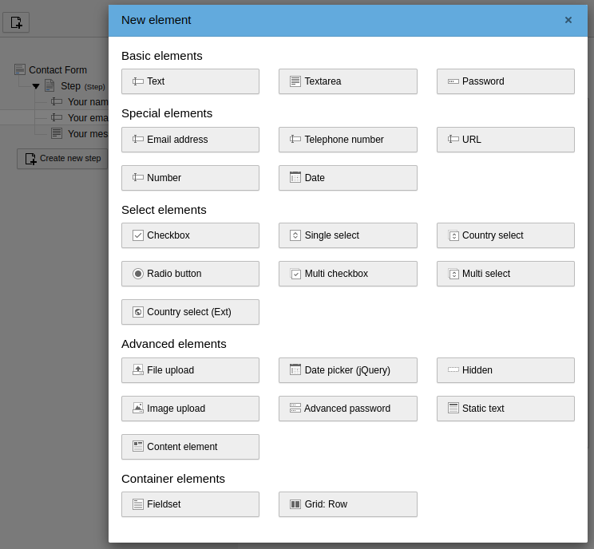

.. include:: /Includes.rst.txt

.. _for-editors:

===========
For Editors
===========

Target group: **Editors**

Go to the :guilabel:`Forms` module and choose an existing form or create a new
form.

Adding a country select element
===============================

To add a country select element on the form, click on the
:guilabel:`Create new element` button at the bottom of the stage area. A modal
window with the :guilabel:`New element` wizard opens:

Under the group :guilabel:`Select elements` you'll find the form element
:guilabel:`Country select`. Click on the element to add it to the form.

Configuration of the element
============================

Now you can configure the country select element:

.. figure:: /Images/element-options.png
   :class: with-shadow
   :alt: Element options

Label
   Enter the label which should be shown to the visitor.

Description
   An additional description can be added to show some more information about
   this form element to the visitor.

First option (empty value)
   By default, the selection field with the countries has no empty option. You
   can enter a value here to add an empty option at the beginning of the country
   list (like the single select element).

Default value
   If desired, insert here the `alpha-2 code`_ of the country you would like to
   be selected by default (e.g. DE for Germany).

Required field
   If an option should be selected then activate this checkbox.

.. _alpha-2 code: https://en.wikipedia.org/wiki/ISO_3166-1_alpha-2
