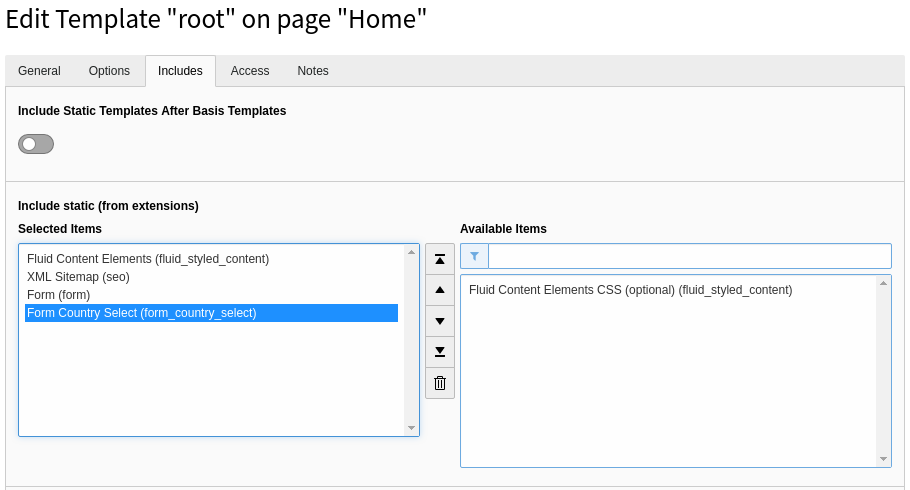

.. include:: ../Includes.txt
.. highlight:: shell

.. _installation:

============
Installation
============

Target group: **Administrators**

.. note::

   The extension supports TYPO3 v9 LTS and TYPO3 v10 LTS.

The recommended way to install this extension is by using Composer. In your
Composer based TYPO3 project root, just type::

   composer req brotkrueml/form-country-select

and the recent stable version will be installed.

You can also install the extension from the `TYPO3 Extension Repository (TER)
<https://extensions.typo3.org/extension/form_country_select/>`_.

.. _include-static-typoscript:

Preparation: Include static TypoScript
======================================

The extension ships some TypoScript code which needs to be included.

#. Switch to the root page of your site.

#. Switch to the :guilabel:`Template module` and select :guilabel:`Info/Modify`.

#. Press the link :guilabel:`Edit the whole template record` and switch to the
   tab :guilabel:`Includes`.

#. Select :guilabel:`Form Country Select (form_country_select)` from the
   available items at the field :guilabel:`Include static (from extensions):`

