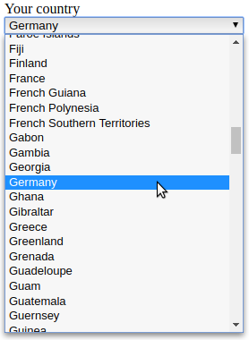

.. include:: ../Includes.txt

.. _introduction:

============
Introduction
============

.. _what-it-does:

What does it do?
================

The extension provides an additional form element for the TYPO3 Form Framework
which displays a select box with all countries from the
`ISO 3166-1 <https://en.wikipedia.org/wiki/ISO_3166-1>`__ standard. The country
list is localised according to the language of the website page.

   A select box with all countries

This is especially useful for forms on websites with an international audience,
where the visitor can select his country.

The value of an option is the `alpha-2 code <https://en.wikipedia.org/wiki/ISO_3166-1_alpha-2>`__
of the country, the label is the localised country name.

.. _where-the-country-list-comes-from:

Where does the country list come from?
======================================

The list of countries is based on the `symfony/intl <https://github.com/symfony/intl>`__
package, which in turn uses the localisation data of the
`ICU library <https://github.com/unicode-org/icu>`__.
